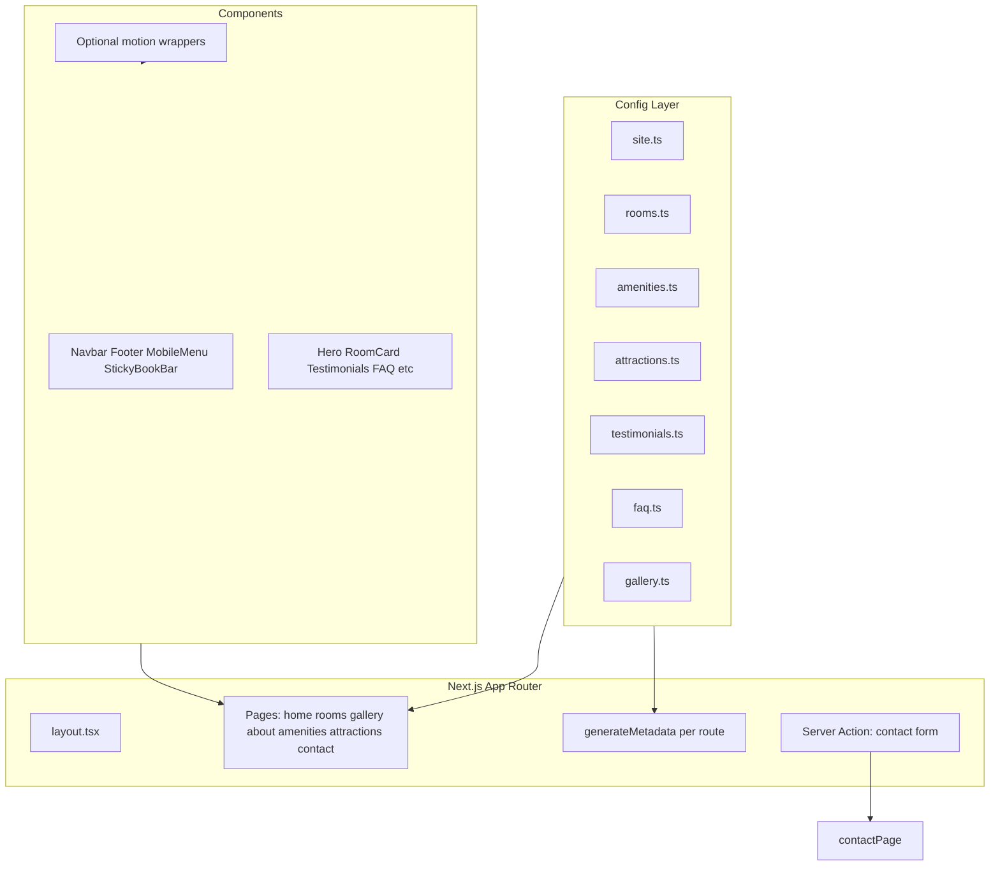

# Luxury Guesthouse Website — V1 Scope & Implementation Plan

> Scaffold a premium, reusable Next.js guesthouse website from scratch in TemplateOne, driven by a single TypeScript config/data layer, with inquiry-only conversion (contact, WhatsApp, phone) and polished luxury UX across 8 core pages.

## Implementation Phases (Checklist)

- [x] **Phase 1 — Foundation:** scaffold, tokens, types, config, layout shell, Navbar, Footer, UI primitives
- [ ] **Phase 2 — Home page:** demo data, all home sections, conversion components, optional motion
- [ ] **Phase 3 — Rooms:** list page, RoomCard, dynamic `[slug]` detail, related rooms
- [ ] **Phase 4 — Remaining pages:** Gallery, About, Amenities, Attractions, Contact
- [ ] **Phase 5 — Polish & SEO:** metadata, JSON-LD, sitemap, perf pass, responsive QA

---

## Context

- **Starting point:** Empty directory — greenfield build.
- **Confirmed decisions:**
  - **Booking:** Inquiry-only (contact form, WhatsApp, phone, email) — no live booking engine.
  - **Content:** Single TypeScript/JSON config layer — rebrand per client by editing data files.

## Architecture Overview



## 1. Project Scaffold

Initialize in project root:

```bash
pnpm create next-app@latest . --typescript --tailwind --eslint --app --src-dir --import-alias "@/*" --use-pnpm
pnpm add framer-motion yet-another-react-lightbox clsx tailwind-merge
```

**Additional setup:**
- `next.config.ts` — remote image domains (Unsplash/demo CDN), strict mode
- `src/app/globals.css` — Tailwind + CSS custom properties for theme tokens
- `src/lib/utils.ts` — `cn()` helper
- `public/robots.txt` and dynamic `src/app/sitemap.ts`

## 2. Folder Structure

```
TemplateOne/
├── src/
│   ├── app/
│   │   ├── layout.tsx              # Root layout, fonts, providers
│   │   ├── page.tsx                # Home
│   │   ├── loading.tsx             # Optional branded loading screen
│   │   ├── rooms/
│   │   │   ├── page.tsx
│   │   │   └── [slug]/page.tsx
│   │   ├── gallery/page.tsx
│   │   ├── about/page.tsx
│   │   ├── amenities/page.tsx
│   │   ├── attractions/page.tsx
│   │   ├── contact/page.tsx
│   │   ├── sitemap.ts
│   │   └── actions/contact.ts      # Server Action for inquiry form
│   ├── components/
│   │   ├── layout/                 # Navbar, Footer, MobileMenu, StickyBookBar
│   │   ├── ui/                     # Button, SectionHeading, Accordion, Badge
│   │   ├── sections/               # Hero, CTA, MapSection, AmenitiesGrid, etc.
│   │   ├── rooms/                  # RoomCard, RoomGallery, RelatedRooms
│   │   ├── gallery/                # MasonryGallery, Lightbox
│   │   ├── motion/                 # FadeIn, StaggerChildren (optional)
│   │   └── conversion/             # WhatsAppFab, CallButton, ContactForm
│   ├── config/
│   │   └── site.ts                 # Brand, nav, contact, SEO defaults, hours
│   ├── data/
│   │   ├── rooms.ts
│   │   ├── amenities.ts
│   │   ├── attractions.ts
│   │   ├── testimonials.ts
│   │   ├── faq.ts
│   │   └── gallery.ts
│   ├── lib/
│   │   ├── utils.ts
│   │   ├── seo.ts                  # Metadata + JSON-LD helpers
│   │   └── types.ts                # Room, Amenity, SiteConfig interfaces
│   └── hooks/
│       └── useScrollReveal.ts
└── public/
    ├── logo.svg
    └── images/                     # Demo assets (or remote Unsplash URLs in data)
```

## 3. Design System

Premium, restrained palette — editable in one place via `src/config/site.ts` and CSS variables in `globals.css`.

| Token | Default | Usage |
|-------|---------|-------|
| `--color-bg` | Warm off-white `#FAF8F5` | Page background |
| `--color-surface` | White `#FFFFFF` | Cards, sections |
| `--color-text` | Charcoal `#1C1C1C` | Body copy |
| `--color-muted` | Warm gray `#6B6560` | Secondary text |
| `--color-accent` | Deep bronze `#8B7355` | CTAs, links, accents |
| `--color-accent-dark` | `#6B5A42` | Hover states |

**Typography (Google Fonts via `next/font`):**
- **Display:** Cormorant Garamond — hero headlines, section titles
- **Body:** DM Sans — paragraphs, UI, nav

**Spacing & layout:**
- Max content width: `1280px` with generous horizontal padding (`px-6 md:px-12 lg:px-20`)
- Section vertical rhythm: `py-20 md:py-28 lg:py-32`
- Soft shadows: `shadow-sm` / custom `shadow-luxury`
- Border radius: subtle (`rounded-lg` for cards, `rounded-full` for pills)

**Demo brand:** *Serenité Guesthouse* — fictional 4-star boutique property (easy to swap in config).

## 4. Config & Data Layer

All client customization flows through typed files. Example shape for `src/config/site.ts`:

```typescript
export const siteConfig = {
  name: "Serenité Guesthouse",
  tagline: "Where tranquility meets refined comfort",
  contact: { phone, email, whatsapp, address, mapEmbedUrl, hours },
  social: { instagram, facebook },
  nav: [{ label, href }],
  seo: { defaultTitle, description, ogImage },
  features: { showPrices: true, stickyBookBar: true },
}
```

`src/data/rooms.ts` — array of `Room` objects with `slug`, `name`, `description`, `shortDescription`, `capacity`, `bedType`, `bathroom`, `price?`, `images[]`, `amenities[]`, `featured`.

Other data files follow the same pattern — pure data, no JSX.

## 5. Core Components

### Layout
- **Navbar** — transparent over hero, solid on scroll; desktop links + "Inquire" CTA
- **MobileMenu** — full-screen overlay, staggered link animation, close on route change
- **Footer** — logo, nav columns, contact, social, copyright
- **StickyBookBar** — mobile-only fixed bottom bar: "Inquire Now" → `/contact`
- **LoadingScreen** — optional branded `loading.tsx`; skip unless it adds value after first perf check

### UI Primitives
- **Button** — variants: `primary`, `outline`, `ghost`; subtle scale + shadow on hover
- **SectionHeading** — display font, optional eyebrow label, fade-in on scroll
- **Accordion** — FAQ with smooth height animation (Framer Motion `AnimatePresence`)

### Sections (composed on pages)
- **LuxuryHero** — full-viewport image, parallax on scroll, headline + dual CTAs
- **RoomCard** — large image, hover zoom + overlay reveal, capacity badge, optional price
- **AmenitiesGrid** — categorized tabs or grouped sections with icons
- **Testimonials** — quote cards with optional star rating / "Google Review" styling
- **GalleryPreview** — 4–6 image grid linking to `/gallery`
- **CTABanner** — full-width accent section with inquiry prompt
- **MapSection** — Google Maps iframe + address block
- **AttractionCard** — image, name, distance, short description

### Gallery
- **MasonryGallery** — CSS `columns` masonry (no heavy JS lib)
- **Lightbox** — `yet-another-react-lightbox` with fade transitions, keyboard nav

### Motion wrappers (`src/components/motion/`) — add as needed
- `FadeIn` — opacity + slight Y translate, viewport-triggered once (recommended for section reveals)
- `StaggerChildren` — staggered child reveals for grids (optional, use on featured room/testimonial grids)
- Parallax on hero — optional; only if it feels natural after the hero is built

**Animation rules:** 0.5–0.8s duration, ease `[0.25, 0.1, 0.25, 1]`, no bounce/spin. Prefer CSS transitions for hovers; reserve Framer Motion for scroll-triggered reveals and the mobile menu.

## 6. Pages & Sections

### Home (`src/app/page.tsx`)
1. LuxuryHero
2. FeaturedRooms (3 rooms from data where `featured: true`)
3. WhyStayHere (3–4 value props with icons)
4. Amenities preview (top categories, link to `/amenities`)
5. GalleryPreview
6. Testimonials
7. NearbyAttractions preview (3 cards)
8. FAQ accordion
9. CTABanner
10. Footer

### Rooms (`src/app/rooms/page.tsx`)
- Page hero (shorter)
- Responsive grid of all `RoomCard` components
- Filter optional in V1: skip (keep simple)

### Room Detail (`src/app/rooms/[slug]/page.tsx`)
- Image gallery carousel/grid
- Description, capacity, bed type, bathroom info
- Room amenity list
- "Send Inquiry" CTA → `/contact?room={slug}`
- Related rooms (same capacity tier or random 2)

### Gallery (`src/app/gallery/page.tsx`)
- MasonryGallery + Lightbox

### About (`src/app/about/page.tsx`)
- Story, mission, values (from config/data)
- Property highlights with side-by-side image + text blocks

### Amenities (`src/app/amenities/page.tsx`)
- Full categorized AmenitiesGrid (Accommodation, Dining, Internet, Parking, Laundry, Family, Accessibility)

### Nearby Attractions (`src/app/attractions/page.tsx`)
- Attraction cards grid
- MapSection at bottom

### Contact (`src/app/contact/page.tsx`)
- ContactForm (name, email, phone, dates, room preference, message)
- Phone, email, address, hours
- MapSection
- WhatsApp + Call prominent buttons
- Server Action validates + returns success/error (log to console in V1; email integration stubbed with comment for Resend/SMTP later)

## 7. Conversion Features

| Feature | Implementation |
|---------|----------------|
| Sticky Book bar | `StickyBookBar` — `md:hidden`, fixed bottom |
| WhatsApp FAB | `WhatsAppFab` — fixed bottom-right, `wa.me/{number}` |
| Call button | In contact page + optional header icon on mobile |
| Inquiry form | Server Action in `actions/contact.ts` |
| Google Reviews | Static testimonials styled as review cards (no API in V1); config flag to swap real embed later |
| Clear CTAs | Every page ends with CTABanner or direct inquiry link |

## 8. SEO & Performance

**Per-route metadata** via `generateMetadata()` using `src/lib/seo.ts`:
- Title template: `{page} | {site.name}`
- Description, Open Graph, Twitter cards
- JSON-LD: `LodgingBusiness` on home, `HotelRoom` on room detail pages

**Performance targets (Lighthouse 95+):**
- `next/image` everywhere with explicit `width`/`height`, `sizes`, `priority` on hero
- Lazy load below-fold images
- Font subsetting via `next/font`
- Minimal client JS — prefer Server Components; `'use client'` only for motion, forms, lightbox, mobile menu
- Dynamic imports for Lightbox and heavy motion on interaction

**Files:**
- `src/app/sitemap.ts` — static + dynamic room slugs
- `public/robots.txt`

## 9. Optional Enhancements ("Wow Moments")

These are **nice-to-have**, not requirements. Implement only where they feel natural and match what premium hotel sites actually do. Skip anything that adds complexity without clear payoff.

| Enhancement | Verdict | Notes |
|-------------|---------|-------|
| Room card hover (zoom + overlay) | **Include** | Standard on luxury hospitality sites |
| Gallery lightbox | **Include** | Expected for any photo gallery page |
| Scroll-triggered section fades | **Include** | Common, subtle, low risk |
| Button hover micro-interactions | **Include** | CSS-only; cheap polish |
| Full-screen mobile menu | **Include** | Fits premium mobile nav pattern |
| Hero parallax / cinematic feel | **Optional** | Large hero photo is required; parallax is extra — try after base hero works |
| Loading screen with logo | **Skip by default** | Uncommon on fast Next.js sites; revisit only if desired |
| Page transitions between routes | **Skip by default** | Rare on hotel sites; can feel sluggish — not worth V1 complexity |
| Ken Burns on hero | **Skip** | Flashy; conflicts with restrained luxury tone |
| Text stagger on hero load | **Optional** | Subtle stagger only if hero feels static without it |

**Rule of thumb:** If a real 4–5 star hotel site wouldn't typically have it, we don't need it either.

## 10. Client Rebrand Workflow

To deploy for a new client, edit only:
1. `src/config/site.ts` — name, contact, colors (CSS vars), SEO
2. `src/data/*.ts` — rooms, amenities, copy, images
3. `public/logo.svg` + favicon
4. Replace demo images in `public/images/` or update URLs in data

No component changes required for a typical rebrand.

## 11. Implementation Phases

We develop **one phase at a time**. Each phase ends with something runnable in the browser before moving on.

---

### Phase 1 — Foundation

**Goal:** A navigable site shell with branding, typography, and shared primitives — no real page content yet.

**Steps:**
1. [x] Run `create-next-app` + install deps (`framer-motion`, `yet-another-react-lightbox`, `clsx`, `tailwind-merge`)
2. [x] Set up folder structure (see Section 2)
3. [x] Configure `next.config.ts` (remote image domains for Unsplash)
4. [x] Define CSS custom properties in `globals.css` + Tailwind theme extension
5. [x] Load fonts via `next/font` (Cormorant Garamond + DM Sans) in root layout
6. [x] Create `src/lib/types.ts` and `src/config/site.ts` with demo brand (*Serenité Guesthouse*)
7. [x] Build UI primitives: `Button`, `SectionHeading`, `Badge`
8. [x] Build `Navbar` (transparent → solid on scroll) and `Footer`
9. [x] Wire root `layout.tsx` with Navbar + Footer; add placeholder `page.tsx` ("Coming soon" or minimal hero stub)
10. [x] Verify dev server runs and nav links resolve (even if pages 404 for now)

**Done when:** Site loads, fonts/colors look premium, nav/footer work on mobile and desktop.

---

### Phase 2 — Home Page

**Goal:** Complete, conversion-ready homepage — the primary sales page.

**Steps:**
1. [x] Populate all demo data files (`rooms`, `amenities`, `testimonials`, `faq`, `attractions`, `gallery`)
2. [x] Build section components: `LuxuryHero`, `FeaturedRooms`, `WhyStayHere`, `AmenitiesPreview`, `GalleryPreview`, `Testimonials`, `AttractionsPreview`, `FAQ`, `CTABanner`
3. [x] Compose home `page.tsx` with all 10 sections
4. Add conversion components: `StickyBookBar` (mobile), `WhatsAppFab`
5. Build `MobileMenu` (full-screen overlay with nav links)
6. Add `FadeIn` wrapper and apply to 2–3 key sections (don't over-animate)
7. Optionally add hero parallax or text stagger — only if base hero needs it
8. Create stub route files for other pages (empty or minimal) so nav doesn't 404

**Done when:** Home page is complete end-to-end, mobile sticky bar + WhatsApp work, site feels luxurious on first impression.

---

### Phase 3 — Rooms

**Goal:** Browse all rooms and view individual room details with inquiry path.

**Steps:**
1. Build `RoomCard` with image, name, description, capacity, optional price, CTA link
2. Add hover effect (image scale + overlay) — CSS-first
3. Build rooms list page with responsive grid + short page hero
4. Build `rooms/[slug]/page.tsx` with `generateStaticParams` from room data
5. Room detail layout: image gallery, description, capacity/bed/bath info, amenity list
6. "Send Inquiry" CTA linking to `/contact?room={slug}`
7. Build `RelatedRooms` section (2 other rooms)
8. Apply scroll fade-ins sparingly on detail page

**Done when:** All demo rooms list and detail correctly; inquiry CTA passes room context to contact.

---

### Phase 4 — Remaining Pages

**Goal:** All secondary pages complete; contact form functional.

**Steps:**
1. **Gallery** — `MasonryGallery` (CSS columns) + `Lightbox` (dynamic import); populate from `gallery.ts`
2. **About** — story/mission/values from config; property highlight blocks with side-by-side layout
3. **Amenities** — full `AmenitiesGrid` with categories from spec
4. **Attractions** — `AttractionCard` grid + `MapSection` at bottom
5. **Contact** — `ContactForm` (name, email, phone, dates, room preference, message); read `?room=` query param
6. Contact page: phone/email/address/hours, WhatsApp + call buttons, map embed
7. Server Action in `actions/contact.ts` — validate fields, return success/error (console log in V1)
8. Add `CTABanner` to pages that lack a strong closing CTA

**Done when:** Every nav link lands on a finished page; contact form submits and shows feedback.

---

### Phase 5 — Polish & SEO

**Goal:** Production-ready metadata, structured data, and performance baseline.

**Steps:**
1. Build `src/lib/seo.ts` helpers for metadata + JSON-LD
2. Add `generateMetadata()` to every page (title, description, OG, Twitter)
3. JSON-LD: `LodgingBusiness` on home, `HotelRoom` on room detail pages
4. Create `sitemap.ts` (static routes + room slugs) and `robots.txt`
5. Audit all images: `next/image`, `sizes`, `priority` on above-fold, lazy below-fold
6. Review `'use client'` boundaries — minimize client JS
7. Run Lighthouse on home, rooms, contact; fix anything blocking 95+ scores
8. Responsive QA pass: mobile nav, sticky bar, thumb-friendly buttons, gallery on small screens
9. Optional: branded `loading.tsx` — only if we want it after perf check
10. Final content/copy review on demo data

**Done when:** Lighthouse 95+ on key pages, all metadata present, no broken links, mobile feels premium.

## 12. Out of Scope for V1

- Live booking engine or calendar availability
- Headless CMS integration
- Admin dashboard
- Multi-language i18n
- Real email delivery (stub only; document Resend hook-up)
- Google Reviews live API (static testimonials instead)
- Analytics (easy add later via config)

## 13. Demo Content Strategy

Use high-quality Unsplash URLs (luxury hotel/interior/nature) in data files — no binary assets committed initially except logo SVG. Keeps repo light; client swaps URLs or adds files to `public/images/`.
