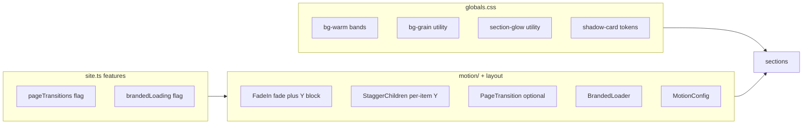

# Visual Polish & Character Pass — V2 Scope

> Add subtle depth, selective grain, fade + Y-axis scroll motion, restrained card shadows, branded loading, and optional page transitions to the completed guesthouse site — strengthening pitch appeal without breaking the restrained luxury tone.

**Prerequisite:** V1 build complete (see `scope.md`). This is a polish pass on the existing codebase, not a redesign.

## Implementation Phases (Checklist)

- [ ] **Phase 1 — Visual foundation:** surfaces, grain, glow, motion system (fade + Y stagger), component polish
- [ ] **Phase 2 — Pitch polish & finish:** branded loading, optional page transitions, optional wow moments, final testing

---

## Context

The site is **technically complete but visually quiet**. This pass adds atmosphere, rhythm, and pitch-ready polish.

**Root causes:**
1. Section contrast too subtle — `bg-bg` vs `bg-surface` barely reads
2. Motion uneven — only ~6 files use Framer Motion; many sections pop in flat
3. Surfaces lack depth — no grain, texture, or ambient light except CTABanner
4. Inner pages flat vs home — `PageHero` has no motion
5. No ownership moment on load for pitch demos

**Confirmed decisions:**

| Decision | Approach |
|----------|----------|
| Backgrounds | Tactile warm bands + soft ambient glow + **selective** grain (~40% of light sections) |
| Scroll motion | Fade + 24px Y rise; grids stagger individually; text blocks move as one unit |
| Card shadows | Light at rest (`--shadow-card`), slightly more on hover — never heavy |
| Page transitions | Optional 250ms opacity fade, config-gated (`pageTransitions: false` default) |
| Loading screen | Branded splash once per session + lighter route loading |
| Don't overdo | No Ken Burns, no horizontal scroll, no bouncy springs, no global grain |

---

## Design Direction: "Quiet Luxury with Depth"

Inspired by [Palazzo Caterina](https://nemanjanedeljkovic.com/case-studies/palazzo-caterina-ux-ui-case-study/), [Uzenie](https://www.nelios.com/featured-project/uzenie-all-suites-boutique-resort/), and [Maison Carlton](https://mutatio.agency/projects/premium-hospitality-web-design/).

- Photography stays the hero
- Motion via [Motion scroll patterns](https://motion.dev/docs/react-scroll-animations) and [transitions](https://motion.dev/docs/react-transitions)
- Extend existing patterns — don't replace the design system



---

# Phase 1 — Visual Foundation

**Goal:** The site feels tactile and alive on scroll — warm section rhythm, selective grain, fade + Y motion on all major content, refined cards and headings.

**Done when:** Scrolling home and inner pages, sections breathe, cards rise in one-by-one, shadows feel decent not heavy, nothing pops in flat.

---

## 1A — Surface Depth, Glow & Selective Grain ✅

> **Status:** Complete

### Expand palette (`src/app/globals.css`)

| Token | Value | Purpose |
|-------|-------|---------|
| `--color-bg-warm` | `#f3efe8` | Alternate warm band |
| `--color-bg-accent-soft` | `#f0ebe3` | Accent-tinted band |
| `--color-border-subtle` | `rgb(28 28 28 / 0.08)` | Section dividers |

Map to Tailwind: `bg-bg-warm`, `bg-accent-soft`, `border-subtle`.

### Background utilities (CSS-only, zero JS)

- **`.bg-grain`** — pseudo-element with inline SVG noise at **2.5–4% opacity**, `pointer-events: none`, `mix-blend-mode: multiply`. No image file.
- **`.section-glow`** — soft radial gradient (`accent` at 4–6% opacity) in one corner. Extends CTABanner pattern.
- **`.section-divider`** — thin top border between major bands.

### Grain placement map (selective — not too much)

Apply `.bg-grain` only on plain text/card sections. **Never** on image heroes, gallery grids, or accent CTA.

| Section | Band | Grain? | Glow? |
|---------|------|--------|-------|
| Featured Rooms | `bg-surface` | Yes | No |
| Why Stay Here | `bg-bg-warm` | Yes | No |
| Amenities Preview | `bg-surface` | No | No |
| Gallery Preview | `bg-accent-soft` | No | Yes |
| Testimonials | `bg-bg-warm` | Yes | No |
| Attractions Preview | `bg-surface` | No | No |
| FAQ | `bg-bg-warm` | Yes | No |
| About Story / Values | warm bands | Yes | No |
| Contact form area | `bg-surface` | Yes | No |
| Footer | `bg-bg-warm` | Optional light | No |

**Rule:** Max ~3–4 grain sections in one viewport scroll. Reduce opacity before removing sections if it reads noisy.

### Home section alternation

```
Hero (image, no grain)
→ bg-surface + grain (Featured Rooms)
→ bg-bg-warm + grain (Why Stay Here)
→ bg-surface (Amenities)
→ bg-accent-soft + glow (Gallery)
→ bg-bg-warm + grain (Testimonials)
→ bg-surface (Attractions)
→ bg-bg-warm + grain (FAQ)
→ bg-accent (CTA)
```

Apply similar alternation to About, Amenities, Contact pages.

**Files:** `globals.css`, `app/page.tsx`, section components, `about/page.tsx`, `amenities/page.tsx`, `contact/page.tsx`.

---

## 1B — Motion System (Fade + Y-Axis Scroll-In) ✅

> **Status:** Complete

**Goal:** Elements drift up slightly as they enter the viewport. Side-by-side cards animate one after another.

### What "fade + Y" means

Every scroll reveal uses **opacity `0 → 1`** and **Y `24px → 0`** together. Subtle upward drift — not a slide from off-screen.

### MotionConfig in root layout

```typescript
<MotionConfig
  transition={{ duration: 0.65, ease: [0.25, 0.1, 0.25, 1] }}
  reducedMotion="user"
>
```

### Two reveal patterns

| Pattern | Component | Use for |
|---------|-----------|---------|
| **Block reveal** | `FadeIn` (enhance existing) | Whole sections, text blocks, single images — one unit |
| **Stagger reveal** | `StaggerChildren` + `StaggerItem` (new) | Grids of cards/images/FAQ side by side — each child animates individually |

**Rule:** Elements **next to each other** in a grid → stagger. One heading + paragraph or full-width block → `FadeIn`.

### Build `StaggerChildren` + `StaggerItem` (`src/components/motion/StaggerChildren.tsx`)

```typescript
// Parent
initial="hidden"
whileInView="visible"
viewport={{ once: true, margin: "-60px" }}

// Child variants
hidden: { opacity: 0, y: 24 }
visible: { opacity: 1, y: 0 }
// stagger: 0.08–0.12s via delayChildren + stagger()
```

**Apply stagger (individual Y per item):**
- Featured room cards, Why Stay Here cards, amenities grids
- Testimonial cards, attraction cards, room listing grid
- Gallery preview tiles + masonry gallery, FAQ items
- Property highlight rows, related rooms on detail page

**Use `FadeIn` (whole block):**
- Section headings (when not in stagger parent), About story, contact intro, CTABanner, single full-width images

### Enhance `FadeIn.tsx`

- Default `y: 24`, optional `y` prop (max 32)
- `viewport.margin: "-60px"`

### Upgrade `PageHero.tsx`

- Text stagger on mount (fade + Y per line)
- Optional 5–8% image parallax via `useScroll` + `useTransform`

### Motion limits (don't overdo)

| Setting | Value |
|---------|-------|
| Y distance | 16–24px max |
| Duration | 0.55–0.7s |
| Stagger delay | 0.08–0.12s per child |
| Trigger | `once: true` always |
| Large grids | ~8 items staggered, rest appear together |

### Standardize across pages

- Remove scattered `animate={false}` inside stagger sections
- Every home section: `FadeIn` or internal `StaggerChildren`
- Inner pages: stagger on grids, `FadeIn` on text

**Files:** `layout.tsx`, `motion/FadeIn.tsx`, `motion/StaggerChildren.tsx`, `motion/index.ts`, `PageHero.tsx`, all section/grid components.

---

## 1C — Component Life (Restrained Shadows)

**Goal:** Cards and headings feel crafted — shadows decent, never heavy.

### Shadow tokens (`globals.css`)

```css
--shadow-card: 0 1px 3px rgb(28 28 28 / 0.04), 0 1px 2px rgb(28 28 28 / 0.03);
--shadow-card-hover: 0 4px 20px rgb(28 28 28 / 0.07);
```

**Card pattern:**
- Rest: `shadow-card` + `ring-1 ring-text/5`
- Hover: `shadow-card-hover` + `translateY(-2px)` optional
- **Do not** use `shadow-luxury` at rest

### Card content polish

- **Testimonials:** decorative quote mark (`font-display`, `text-accent/12`)
- **WhyStayHere:** extend amenity-style icon hover from `AmenitiesPreview`
- **RoomCard:** padded text block below image; stagger on rooms page
- Keep existing image hover zoom

### Footer + headings

- **Footer:** `bg-bg-warm` + thin accent top border + social hover to accent
- **SectionHeading:** small accent line under eyebrow (24px wide)

### StickyBookBar

Gentle slide-up on mount (~300ms).

**Files:** card section components, `RoomCard.tsx`, `Footer.tsx`, `SectionHeadingContent.tsx`, `StickyBookBar.tsx`.

---

## Phase 1 — Files Most Affected

| Priority | Files |
|----------|-------|
| High | `globals.css`, `app/page.tsx`, `layout.tsx`, `motion/StaggerChildren.tsx`, `motion/FadeIn.tsx` |
| Medium | `WhyStayHere.tsx`, `Testimonials.tsx`, `FeaturedRooms.tsx`, `PageHero.tsx`, `RoomCard.tsx`, `Footer.tsx`, `FAQ.tsx`, `GalleryPreview.tsx` |
| Low | Inner page routes, `AmenitiesPreview.tsx`, `AttractionsPreview.tsx`, `PropertyHighlights.tsx` |

---

# Phase 2 — Pitch Polish & Finish

**Goal:** Branded first-load experience, optional page fades for demos, any remaining wow moments, then verify everything works.

**Done when:** Cold open shows brand splash; optional route fade works; pitch demo walkthrough feels calm, branded, alive; all checks pass.

---

## 2A — Branded Loading & Optional Page Transitions

### Branded initial load splash

New: `src/components/layout/BrandedLoader.tsx`

- Full-screen: warm `bg-bg` + light grain
- Centered logo SVG + `siteConfig.name` in `font-display`
- Logo fade in → brief hold → fade out (**~900–1200ms** total)
- `sessionStorage` key (`serenite-splash-seen`) — **once per browser session**
- Gated by `siteConfig.features.brandedLoading` (default `true`)

Also: `src/app/loading.tsx` for route changes
- Minimal logo pulse at 40% opacity
- Skip full block if splash already shown this session

### Optional page transitions

New: `src/components/motion/PageTransition.tsx`

- Wrap `{children}` in layout; **250ms opacity crossfade** on pathname change
- `AnimatePresence` + `motion.div` keyed on route
- Gated by `siteConfig.features.pageTransitions` (default `false`)
- Skip when `prefers-reduced-motion: reduce`
- Opacity only — no layout shift

Add to `src/config/site.ts`:

```typescript
features: {
  // ...existing
  brandedLoading: true,
  pageTransitions: false,  // flip true during owner demos
}
```

**Files:** `BrandedLoader.tsx`, `PageTransition.tsx`, `loading.tsx`, `layout.tsx`, `config/site.ts`.

---

## 2B — Targeted "Wow" Moments (Optional)

Pick 1–2 only if site still feels too quiet after Phase 1 + 2A.

| Enhancement | Where | API |
|-------------|-------|-----|
| Image clip reveal | `PropertyHighlights` | `useScroll` + `clipPath` transform |
| Light PageHero parallax | Inner pages | Already in Phase 1B if implemented |

**Skip:** scroll progress bar, testimonial carousel, Ken Burns.

Gallery/card Y-axis stagger is **core in Phase 1B**, not optional here.

---

## 2C — Final Testing & Check

> No new features. Test what was built, fix anything broken, confirm it feels right.

**Checklist:**

1. **Speed check** — Lighthouse on home + rooms; target 95+ (splash once per session)
2. **Accessibility** — `prefers-reduced-motion`: splash, transitions, Y stagger, parallax disabled or instant
3. **Readability** — text on warm/grain backgrounds passes contrast
4. **Mobile** — no scroll jank from grain; sticky bar + WhatsApp don't overlap; stagger not sluggish
5. **Loading timing** — splash ~1s max, route loading lighter
6. **Pitch demo walkthrough** — fresh open → logo/name → scroll home (cards rise in) → navigate to Rooms (optional fade) → overall feel calm and branded

---

## Phase 2 — Files Most Affected

| Priority | Files |
|----------|-------|
| High | `BrandedLoader.tsx`, `PageTransition.tsx`, `layout.tsx`, `loading.tsx`, `config/site.ts` |
| Medium | `PropertyHighlights.tsx` (if clip reveal) |
| Low | None — Phase 2C is testing only |

---

## What Success Looks Like (Pitch Demo)

A guesthouse owner should feel:

- **"This is my brand"** — splash on first open with logo and name
- **"The sections breathe"** — warm bands, soft glow, grain you feel but don't notice
- **"It feels expensive"** — gentle card depth, not heavy shadows
- **"Things move gracefully"** — cards rise in one-by-one; text drifts up; optional page fade
- **"It's still elegant"** — nothing flashy, grain selective, shadows restrained

---

## Out of Scope

- Ken Burns, horizontal scroll sections, parallax on every page
- New accent colors or bright gradients
- Bouncy springs, spinning loaders, looping ambient animation
- Live booking, CMS, i18n changes

---

## Estimated Scope

- **~20–25 files** touched across both phases
- **No new dependencies** (Framer Motion already installed)
- Work **Phase 1 first**, then **Phase 2**
